# MOIM
소모임을 만들고 참여할 수 있는 소모임 커뮤니티, 모임
  

## Skills (Back)

 
  
  
  
   
  
  
   
  
   
  
  
  
   

 

## 개발기간
2023.08 ~ 2023.09, 2023.12
 
 

## 서버배포주소
http://43.200.194.124:8080 -> 비용문제로 내려간 상태
 
 

## 기능상세 및 화면
1. 회원가입 
  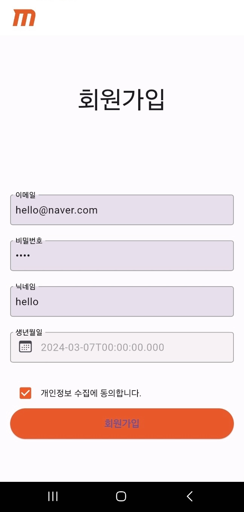
   

2. 로그인 
  일반로그인과 소셜로그인을 지원합니다.
  
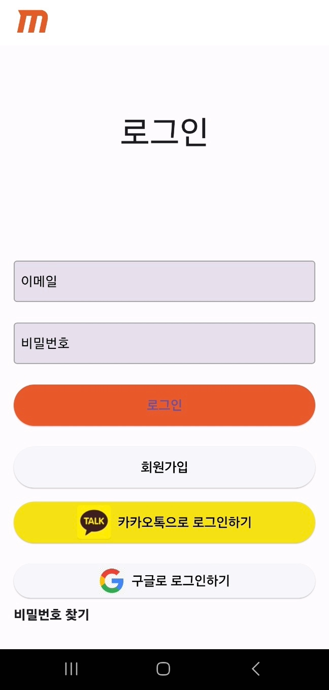

   

3. 마이페이지 
  내 정보를 등록하고 수정하고, 회원이미지를 등록할 수 있습니다.
  
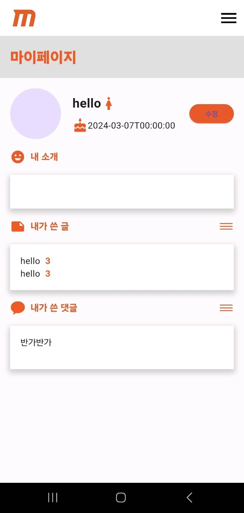 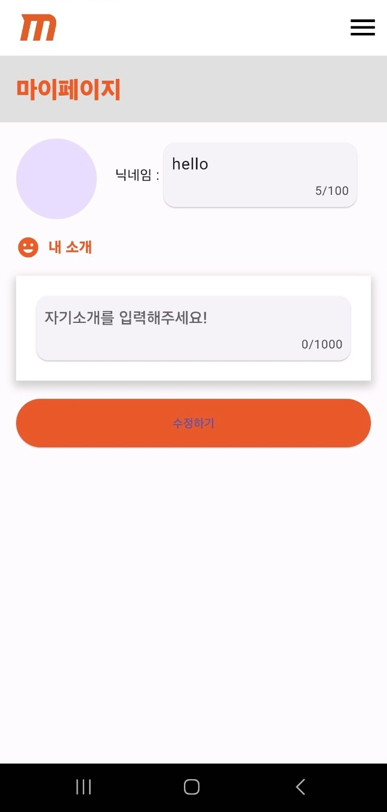

   

4. 모아보기 
  가입한 모임의 소식과 지금 핫한 모임, 새로 생긴 모임을 확인할 수 있습니다.
  
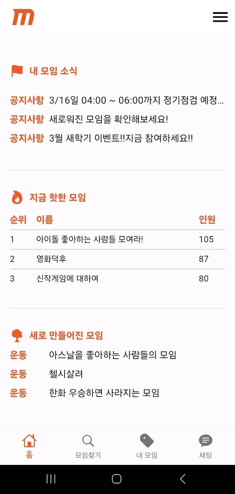

   
  
5. 자유게시판 
  모임에 가입하지 않아도 자유게시판에서 소통을 할 수 있습니다. 
  
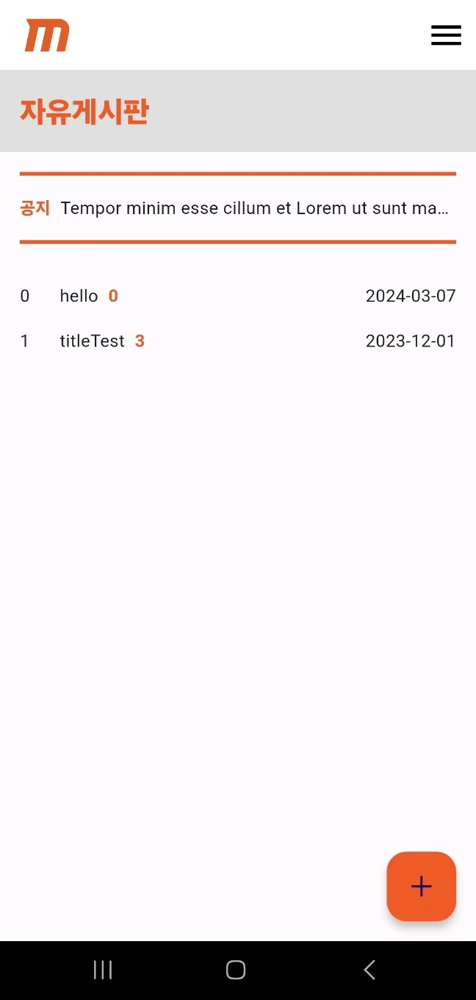

   

6. 모임생성 
  누구나 모임을 생성할 수 있습니다. 이미지 등록도 가능합니다.
  
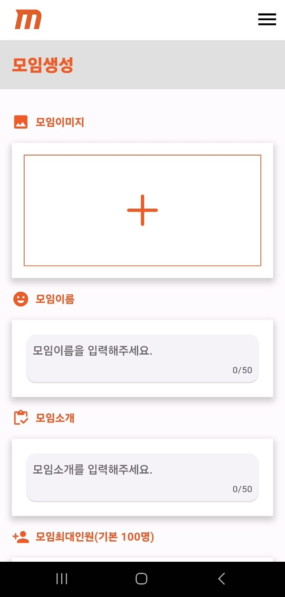 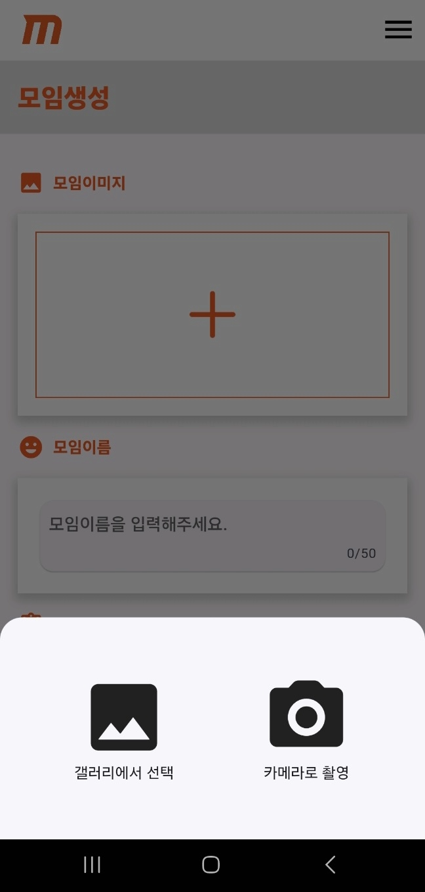

   

7. 모임찾기 
  카테고리별로 원하는 모임을 찾을 수 있습니다.
  
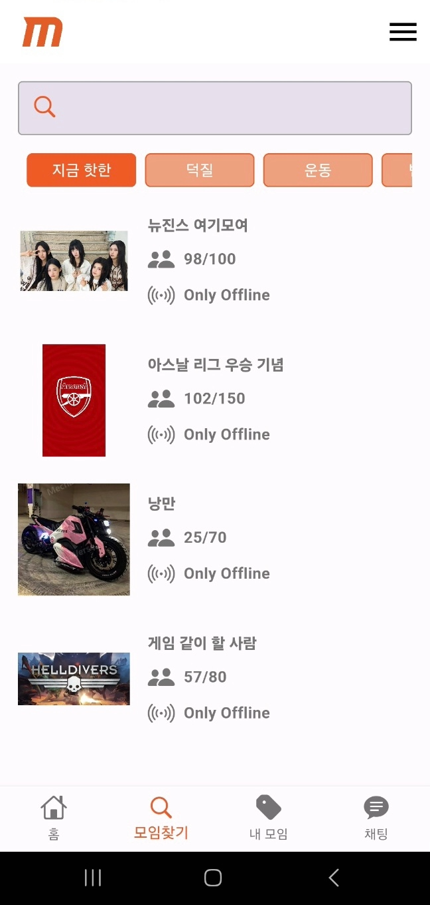

   

8. 모임게시판 
  모임 별 게시판을 별도로 사용 가능합니다. 
  
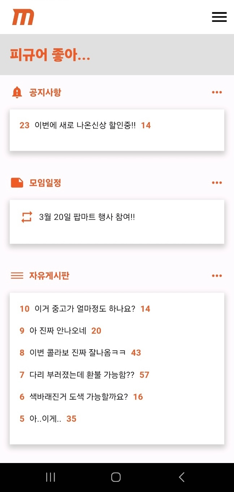

   

9. 게시글상세 
  게시글과 댓글의 작성, 수정, 삭제가 가능합니다.
  
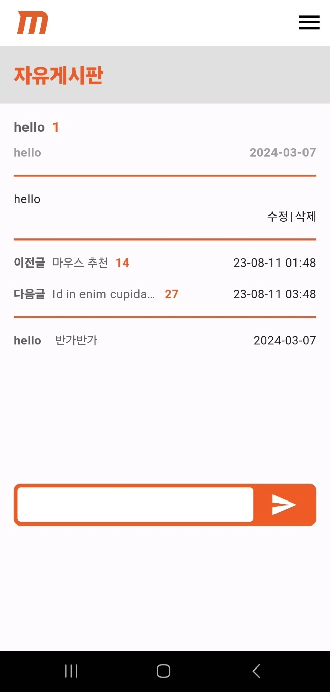

